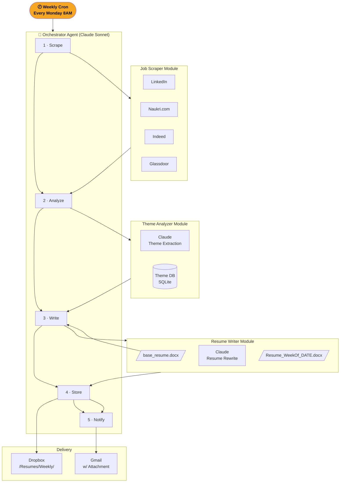
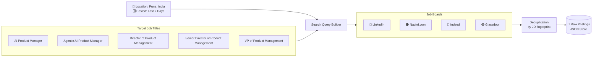
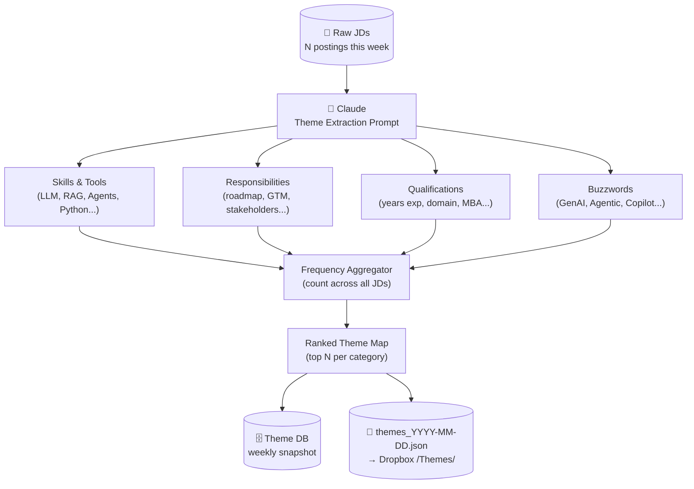
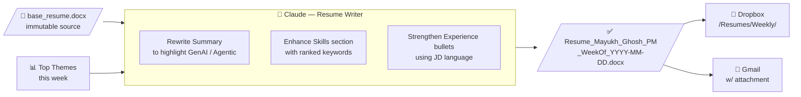
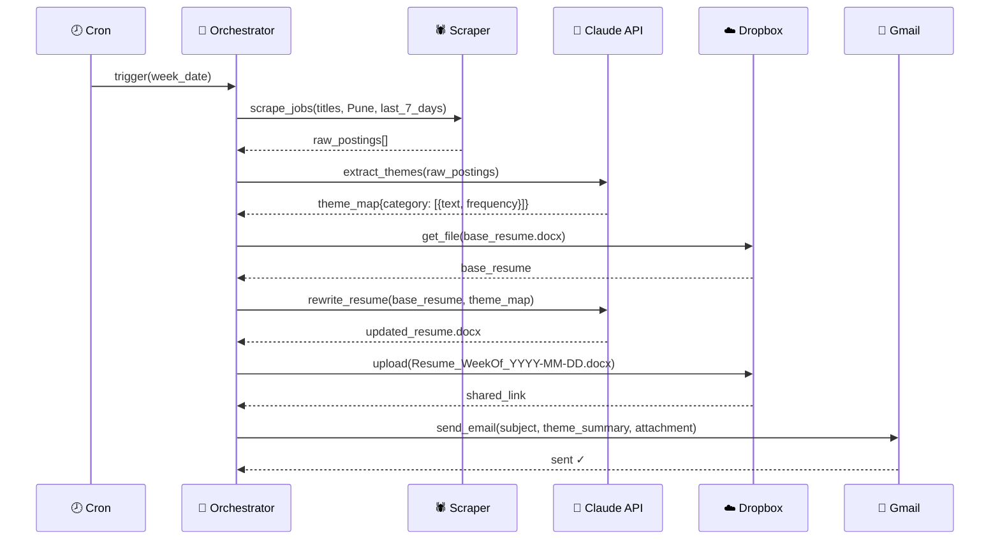
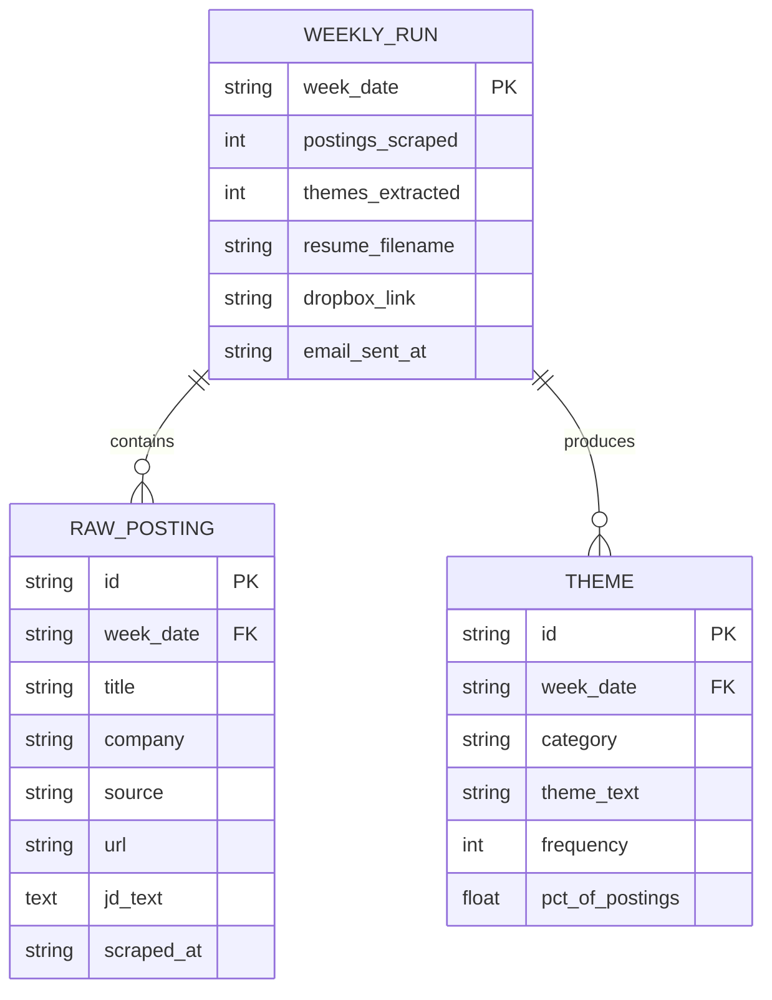
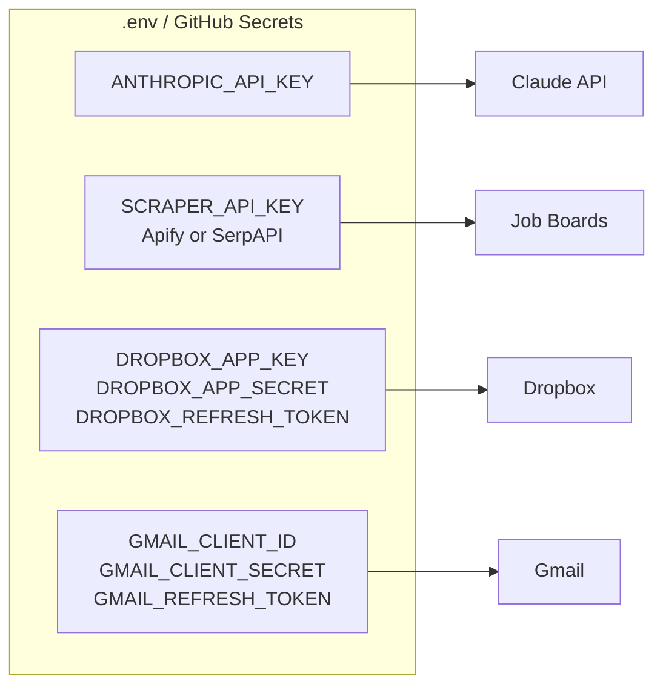

# Architecture — Visual Design

## 1. High-Level System Flow



---

## 2. Job Scraper — Search Parameters



---

## 3. Theme Extraction Pipeline



---

## 4. Resume Generation



---

## 5. Weekly Execution Sequence



---

## 6. Data Model



---

## 7. Folder Structure

```
mg-ai-job-scanner/
│
├── .github/workflows/
│   └── weekly_scan.yml          ← Cron trigger (Monday 8AM IST)
│
├── src/
│   ├── main.py                  ← Orchestrator entry point
│   ├── scraper/
│   │   ├── linkedin.py
│   │   ├── naukri.py
│   │   └── indeed.py
│   ├── analyzer/
│   │   └── theme_extractor.py   ← Claude theme extraction
│   ├── resume/
│   │   └── writer.py            ← Claude resume rewriter
│   └── integrations/
│       ├── dropbox_client.py
│       └── email_client.py
│
├── data/
│   ├── base_resume/             ← Your immutable base resume
│   ├── raw_postings/            ← Weekly JD JSON dumps
│   └── themes/                  ← Weekly theme snapshots
│
├── DESIGN.md
├── ARCHITECTURE.md              ← This file
├── README.md
└── requirements.txt
```

---

## 8. Credentials & Environment Variables


