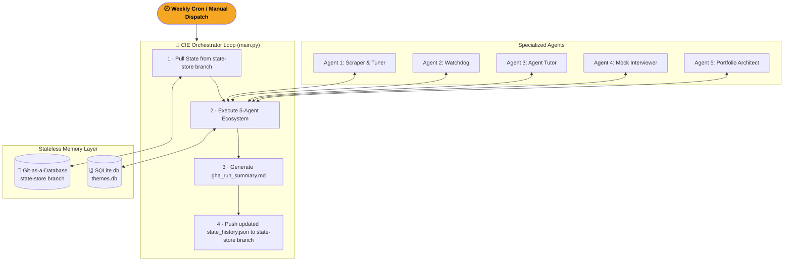
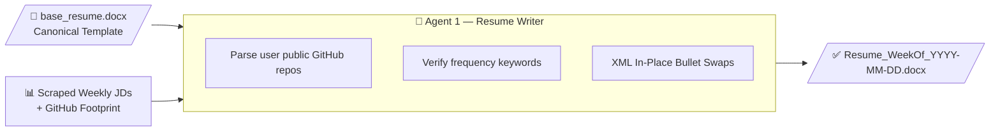
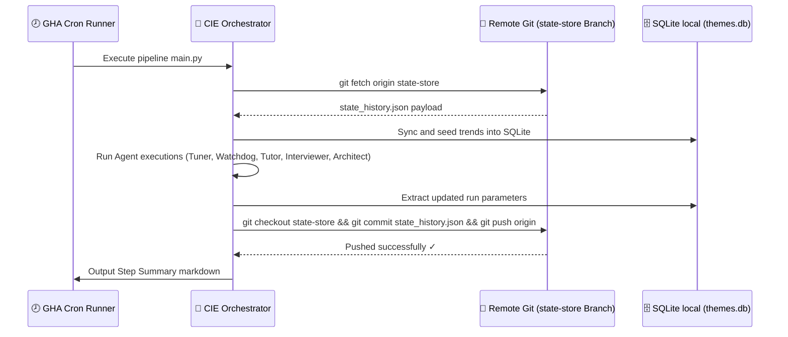
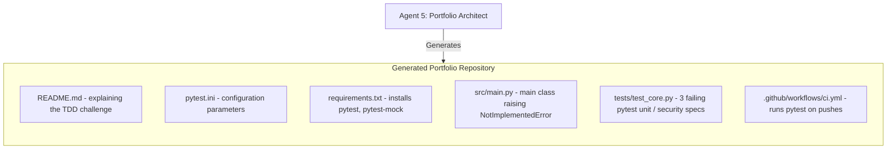

# Career Intelligence Engine (CIE) — Architecture & Mermaid Diagrams

This document outlines the visual system engineering layout, relational tables, and pipeline sequences defining the **Career Intelligence Engine (CIE)**.

---

## 1. High-Level Multi-Agent Architecture

The Orchestrator agent boots inside GitHub Actions, pulls remote memory states, coordinates specialized agents via SQLite persistence, and writes back outputs to Git branches and GHA Summaries.



---

## 2. Ingestion & Resume In-Place Rewrite Pipeline (Agent 1)

Swaps experience bullets using programmatic python-docx XML manipulation while analyzing the candidate's GitHub footprint.



---

## 3. Git-as-a-Database State Synchronization Sequence



---

## 4. TDD Project Scaffolding Structure (Agent 5)

Rather than plain boilerplate, CIE scaffolds fully functional, failing Pytest TDD repositories.



---

## 5. Folder Architecture

```
mg-ai-job-scanner/
│
├── llms.txt                     ← Standard discovery profile for LLMs
├── llms-full.txt                ← Detailed specification sheet for LLMs
│
├── .github/workflows/
│   └── weekly_scan.yml          ← GHA with contents:write permission
│
├── config/
│   └── settings.yaml            ← Swappable model parameters
│
├── data/
│   ├── base_resume/             ← Immutable master resume
│   ├── store/
│   │   ├── themes.db            ← Relational database
│   │   └── state_history.json   ← Versioned state file
│   ├── tutor/
│   │   └── briefs/
│   │       └── brief_*.md       ← Pre-anchored NotebookLM briefs
│   └── portfolio/
│       └── scaffolds/           ← Local directories of scaffolded TDD labs
│
├── src/
│   ├── main.py                  ← Orchestrator Loop
│   ├── onboard.py               ← Onboarding Wizard
│   │
│   ├── analyzer/
│   │   ├── trending.py          ← SQLite Persistence
│   │   ├── git_database.py      ← Git-as-a-Database
│   │   └── observability.py     ← LLMOps Trace Observability
│   │
│   ├── tutor/
│   │   ├── agent_tutor.py       ← Upskilling brief compiler
│   │   ├── source_extractor.py  ← arXiv & GitHub crawler
│   │   └── notebooklm_client.py  ← Mock NotebookLM integrations
│   │
│   └── portfolio/
│       └── portfolio_architect.py ← failing pytest scaffold builder
```
