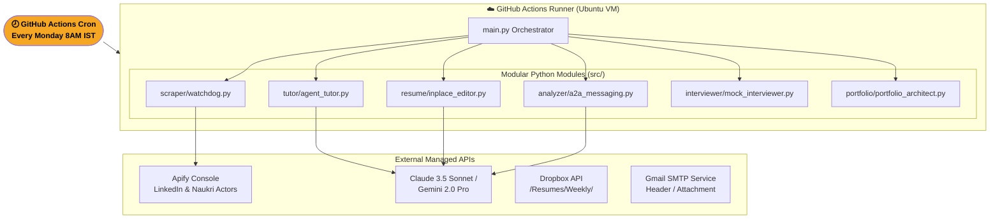
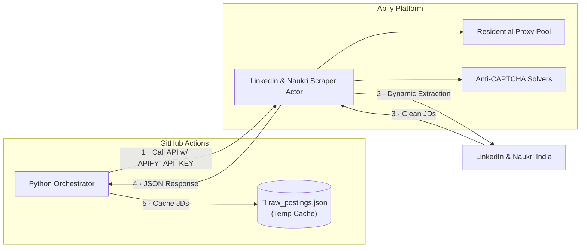
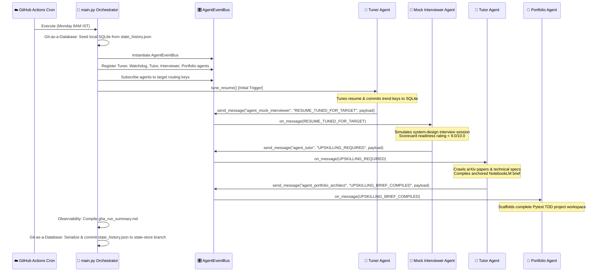
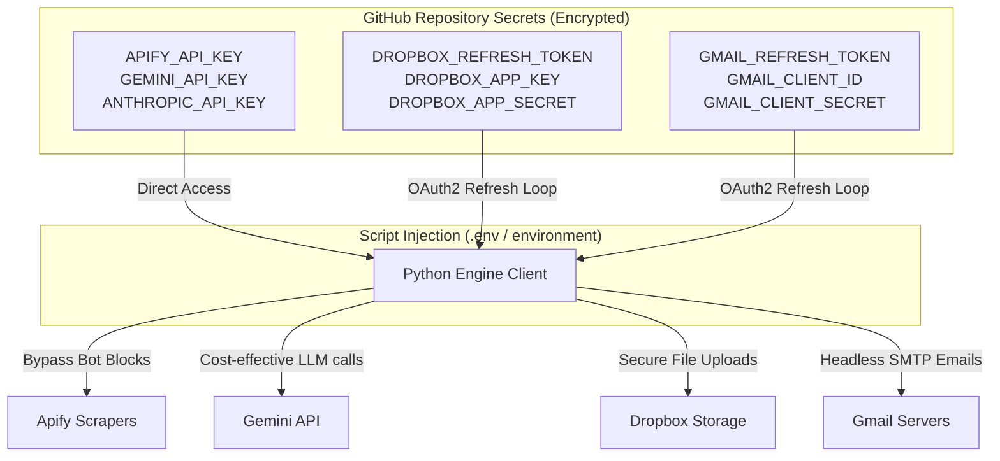

# Visual Architecture — Option 3 Hybrid Design

## 1. High-Level Flow (Serverless Cloud Cron)



---

## 2. Ingestion & Scraping Pipeline



---

## 3. In-Place Resume Edit Pipeline

```mermaid
flowchart TD
    BASE[/📄 base_resume.docx\n(Dropbox Immutable Base)/]
    THEMES["📊 Top Weekly Themes\n(SQLite Summary)"]

    BASE --> EDIT[python-docx Parser]
    THEMES --> EDIT

    subgraph EDIT["python-docx Node Editing Engine"]
        direction TB
        P1[Read Paragraph Bullet Runs]
        MAP[Filter Experience & Summary Paragraphs]
        LLM["🤖 Call LLM Router\n(Gemini 2.0 / Claude 3.5)"]
        INJECT[Inject Polished Text directly into XML node runs]
        
        P1 --> MAP --> LLM --> INJECT
    end

    EDIT --> NEW[/"✅ Resume_WeekOf_DATE.docx\n(Preserves layout, colors, and fonts)"/]
```

---

## 4. Sequence Flow (Reactive Event Bus Cascade)



---

## 5. Unified Credentials & Secrets Layout


