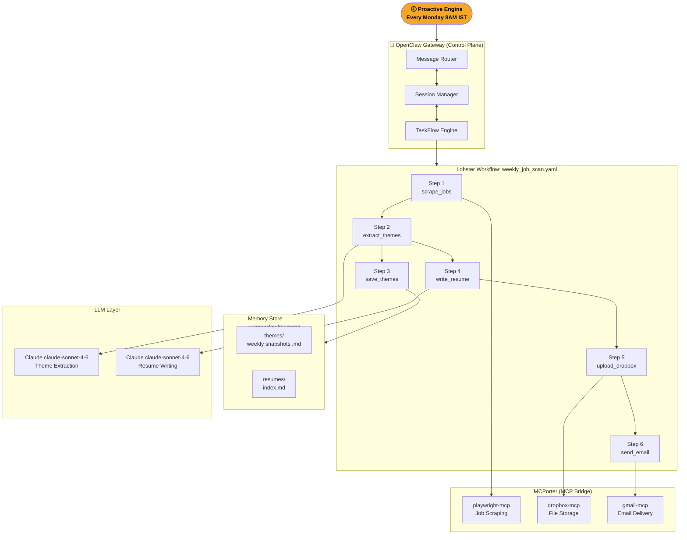
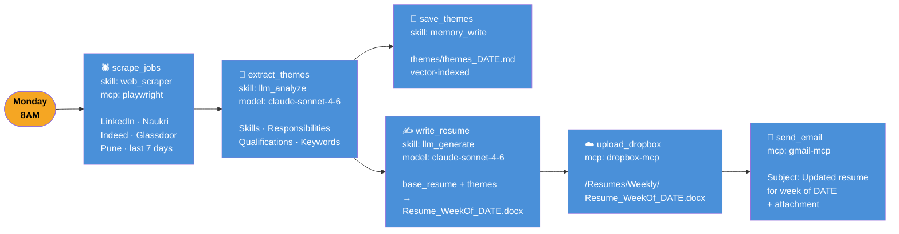
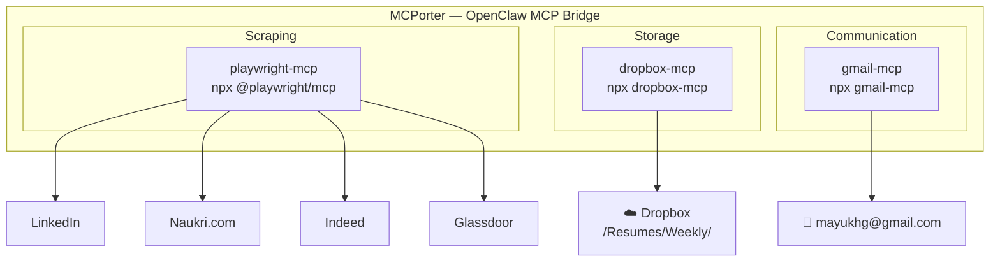
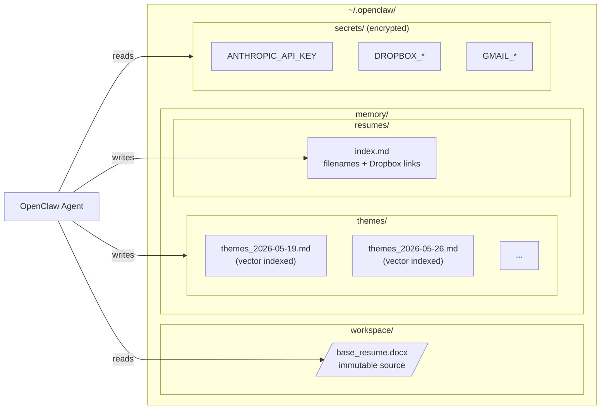
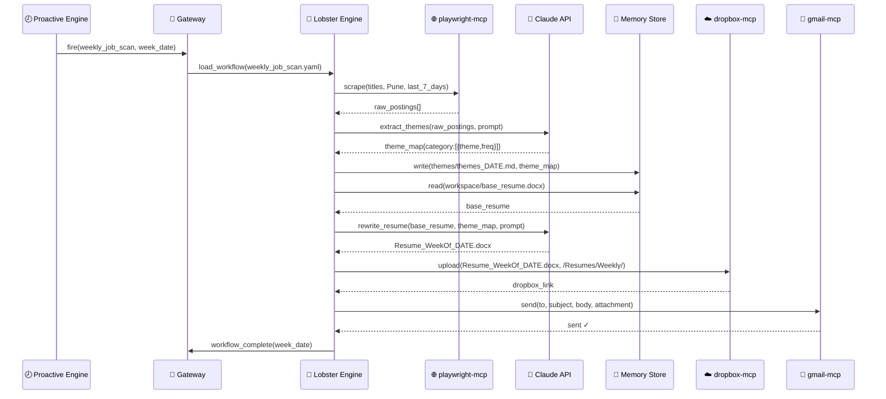
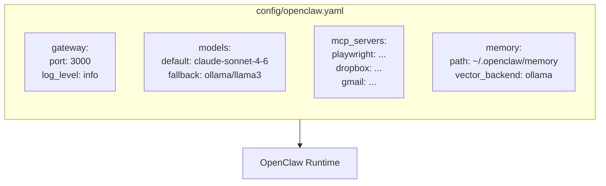
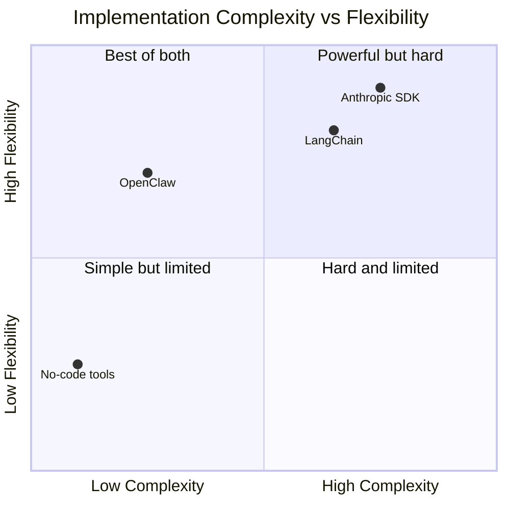

# Architecture — OpenClaw Visual Design

## 1. OpenClaw Runtime Overview



---

## 2. Lobster Workflow — Step-by-Step



---

## 3. MCPorter Integration Map



---

## 4. Memory Architecture



---

## 5. Sequence Diagram



---

## 6. Config File Structure



---

## 7. SDK vs OpenClaw Side-by-Side



---

## 8. Project File Map

```
mg-ai-job-scanner/
│
├── workflows/
│   └── weekly_job_scan.yaml     ← entire pipeline in ~80 lines of YAML
│
├── prompts/
│   ├── theme_extraction.md      ← LLM prompt for theme analysis
│   ├── resume_writer.md         ← LLM prompt for resume rewrite
│   └── email_body.md            ← email body template
│
├── skills/
│   └── naukri_scraper.py        ← custom AgentSkill for Naukri.com
│
├── config/
│   └── openclaw.yaml            ← gateway, models, MCP, memory config
│
└── workspace/
    └── base_resume.docx         ← your immutable base resume
```
