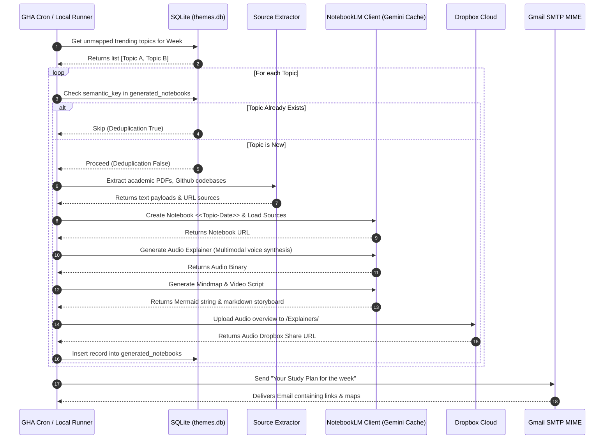

# Agent Tutor Design & Architecture — Upskilling Engine

This document details the architectural expansion of the **mg-ai-job-scanner** into a stateful **Career Intelligence Engine** via the introduction of **Agent Tutor**. 

Agent Tutor bridges the gap between weekly job market scans and personal skill acquisition. It analyzes weekly trending keywords, deduplicates them against existing learning history, aggregates source materials, instantiates structured learning environments, and compiles media assets (audio, mindmaps, video layouts) for study.

---

## 1. System Topology

```
                  ┌────────────────────────────────────────┐
                  │       Weekly Ingestion Pipeline        │
                  │ (Apify Crawler ➔ SQLite JDs Raw Store) │
                  └───────────────────┬────────────────────┘
                                      │
                  ┌───────────────────▼────────────────────┐
                  │         SQLite Themes Engine           │
                  │   (Extracts Technical Trend Deltas)    │
                  └───────────────────┬────────────────────┘
                                      │
                  ┌───────────────────▼────────────────────┐
                  │             Agent Tutor                │
                  │    (Validates Deduplication state)     │
                  └─────────┬───────────────────┬──────────┘
                            │                   │
                 ┌──────────▼────────┐ ┌────────▼──────────┐
                 │ Source Extractor  │ │NotebookLM Client  │
                 │ (arXiv/Web Search)│ │(Gemini Multi-Mode)│
                 └──────────┬────────┘ └────────┬──────────┘
                            │                   │
                            └─────────┬─────────┘
                                      │
                  ┌───────────────────▼────────────────────┐
                  │    Explainers Compilation & Delivery   │
                  │   (Dropbox Sync ➔ Gmail SMTP Study)    │
                  └────────────────────────────────────────┘
```

---

## 2. Storage & Versioning Schemas

To maintain clean, persistent relational history across ephemeral cloud VM boots (via Dropbox Round-Trip Sync), the local database `themes.db` is expanded with two highly structured tables:

### 2.1 Table: `trending_topics`
Logs frequency-weighted trending titles extracted from weekly JDs.
```sql
CREATE TABLE IF NOT EXISTS trending_topics (
    id INTEGER PRIMARY KEY AUTOINCREMENT,
    week_identifier TEXT NOT NULL,       -- ISO Year-Week format (e.g., "2026-W21")
    topic_name TEXT UNIQUE NOT NULL,     -- e.g., "LangGraph Hierarchical Agents"
    semantic_key TEXT UNIQUE NOT NULL,   -- Normalised key for matching (e.g., "langgraph_hierarchical_agents")
    importance_score REAL,               -- Normalised JD frequency weight (0.0 to 1.0)
    source_job_urls TEXT,                -- JSON array of source job description URLs
    created_at TIMESTAMP DEFAULT CURRENT_TIMESTAMP
);
```

### 2.2 Table: `generated_notebooks`
Maintains records of instantiated study notebooks and their generated resources to ensure deduplication.
```sql
CREATE TABLE IF NOT EXISTS generated_notebooks (
    id INTEGER PRIMARY KEY AUTOINCREMENT,
    topic_name TEXT NOT NULL,
    notebook_id TEXT NOT NULL,           -- Public/Shared workspace identifier
    notebook_url TEXT NOT NULL,          -- HTTPS redirect target
    audio_explainer_url TEXT,            -- Dropbox storage backup path
    mindmap_mermaid TEXT,                -- Embedded Mermaid mindmap markdown
    video_script TEXT,                   -- Structured conceptual explainer layout
    created_at TIMESTAMP DEFAULT CURRENT_TIMESTAMP,
    FOREIGN KEY(topic_name) REFERENCES trending_topics(topic_name)
);
```

---

## 3. Core Component Specifications

### 3.1 Topic Deduplication Logic
Before initiating costly API calls to Google Cloud or Web Search extractors, Agent Tutor conducts semantic normalization. 

```
[New Weekly Topic] ➔ Normalize String (Remove Plurals/Symbols) ➔ Create semantic_key
                          │
                          ├─► Match exists in SQLite Table `generated_notebooks`?
                          │         ├─► YES: Skip Instantiation (Log: Duplicate Detected)
                          │         └─► NO: Proceed to Extraction & NotebookLM Client
```

### 3.2 Multi-Source Extractor (`source_extractor.py`)
Queries public academic and developer platforms to collect highly-grounded reading materials for the target topic:
* **arXiv API**: Fetches raw PDF links for recent scholarly publications on the target technology (e.g., searching `all:"LangGraph"` or `all:"Agentic AI"`).
* **GitHub Repository Search**: Extracts standard developer READMEs, technical documentation, and exemplary codebases.
* **Google Search/SerpAPI (Optional)**: Gathers verified corporate documentations (e.g., Google Cloud/Anthropic developer guides).

### 3.3 Modular NotebookLM Client (`notebooklm_client.py`)
Designed to accept an interchangeable authentication wrapper to support two operational pathways:
1. **NotebookLM Enterprise API**: Natively invokes `google-notebooklm` client libraries to instantiate remote workspaces, bind sources, and generate double-host podcast overviews.
2. **Universal Gemini Context Caching Caching (Developer Fallback)**:
   * Programmatically reads source files (GitHub READMEs, arXiv PDFs).
   * Bundles content into a **Gemini Context Cache** (dramatically reducing token consumption for iterative prompts).
   * Calls `gemini-2.0-flash` with structured system instructions and Audio Multimodal settings to synthesize a high-fidelity two-voice conversational `.wav` podcast grounded directly on the sources.

### 3.4 Explainer Video & Mindmap Synthesis
* **Explainer Mindmap**: The analyzer returns a normalized hierarchical Markdown schema easily rendered as a visual **Mermaid Diagram**.
* **Explainer Video Script**: Generates a standard visual storyboarding layout in markdown format (Visual cues, Narrator transcript, Code snippets) ready for recording.

---

## 4. Execution Sequence



---

## 5. Future Agent Extensions

Aligned with Option 3's core design philosophy (stateless cloud containers, database persistence, and configuration-driven orchestration), the Career Intelligence Engine can be expanded with the following agents:

### 5.1 Agent Mock Interviewer (The Interview Coach)
* **Design Philosophy**: Stateless interactive session driver.
* **Mechanism**:
  1. Reads the latest weekly trending topic and your resume.
  2. Queries Gemini to generate a JSON list of 5 high-fidelity technical and situational interview questions.
  3. Spawns an interactive Terminal (or local text file input session) for responses.
  4. Evaluates responses against model answers, logging scorecards to SQLite and Dropbox to track your interview readiness metrics.

### 5.2 Agent Opportunity Watchdog (Stealth Job Scraper)
* **Design Philosophy**: Direct ATS endpoint crawler.
* **Mechanism**:
  1. Periodically crawls corporate ATS systems (Greenhouse, Lever) for a curated shortlist of high-growth AI companies.
  2. Bypasses broad aggregate job boards to identify stealth listings.
  3. Cross-references open requirements with your profile to notify you of immediate high-probability applications.

### 5.3 Agent Portfolio Architect (Project Suggestion Engine)
* **Design Philosophy**: Modular codebase scaffolding.
* **Mechanism**:
  1. Identifies trending technical keywords (e.g., "SQLite GHA round-trip").
  2. Translates the technical concept into a miniature open-source portfolio project specification.
  3. Automatically scaffolds a code framework (creating `README.md`, testing directories, and structural python main templates) and pushes it to your GitHub portfolio under `mg-ai-job-scanner-labs/<<concept>>` to showcase proof-of-work to recruiters.
