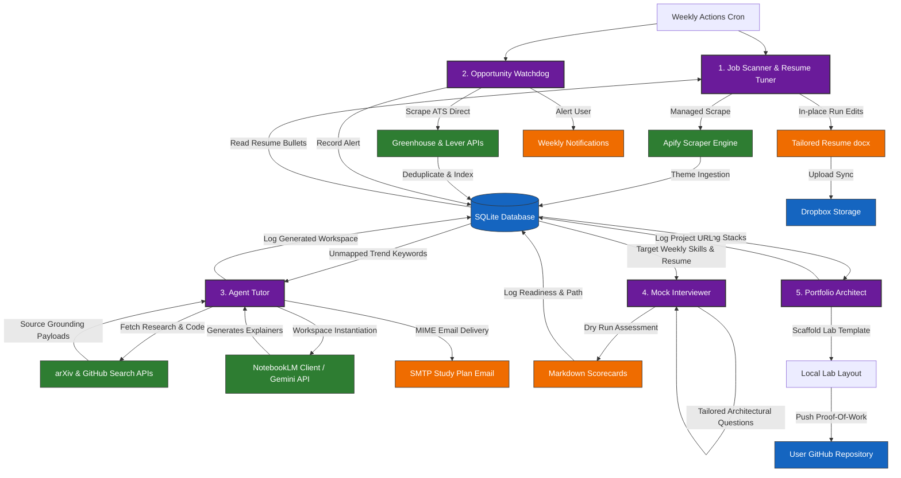

# The Career Intelligence Engine: A Serverless Multi-Agent Ecosystem for Active Career Optimization

> [!NOTE]
> **Pitch Thesis**: In the rapidly evolving landscape of Artificial Intelligence, job hunting for an **Agentic AI Product Manager** requires more than a static resume. It demands a demonstration of the very technology you build. This system is a production-grade, serverless multi-agent architecture that acts as a continuous personal career optimization engine. It showcases technical depth, commercial judgment, and product design pragmatism.

---

## 1. The Core Vision: Personal Career Intelligence

The standard job hunting workflow is broken—especially in high-stakes emerging disciplines like Agentic AI:
* **Market Friction**: Job boards change daily, and recruiters use automated ATS scanners that filter out resumes lacking precise weekly keyword alignments.
* **Skill Drift**: The "state of the art" in AI agents changes every week. A technology that is popular today (e.g., custom orchestrators) might be replaced by specialized patterns (e.g., hierarchical swarms or SQLite round-trip sync containers) next Monday.
* **The Solution**: The **Career Intelligence Engine**—an autonomous multi-agent serverless ecosystem that scans regional job boards, scrapes stealth corporate ATS pipelines, normalizes strategic hiring trends, updates the applicant's master resume *in-place*, constructs target upskilling workspaces with multi-modal explainers, conducts adaptive mock interview dry-runs, and programmatically scaffolds and publishes open-source proof-of-work repositories.

---

## 2. Unified Agentic Workflow & Architecture

The Career Intelligence Engine is orchestrated by five specialized, autonomous agents that coordinate state and execution via a central SQLite persistence layer (`themes.db`) synced round-trip to cloud storage (Dropbox).

### The 5 Core Agents:
1. **Job Scanner & Resume Tuner**: Aggregates job postings using managed crawlers, extracts frequency-weighted themes, and updates experience bullets in the applicant's master resume *in-place* to preserve professional typography and layout.
2. **Agent Opportunity Watchdog**: Bypasses aggregator job boards to parse public Greenhouse and Lever ATS endpoints of selected, high-growth AI companies, flagging and cataloging stealth postings the moment they launch.
3. **Agent Tutor**: Evaluates new trending skills against completed workspaces. It retrieves academic research papers (arXiv) and technical repositories (GitHub APIs), programmatically instantiates Google NotebookLM learning workspaces (or Gemini cached models), generates conversational audio podcasts, visual mindmaps, and emails a structured Weekly Study Plan.
4. **Agent Mock Interviewer**: Reads current SQLite technical trends and the tailored resume, designs situational, coding, and technical system-architecture interview questions, executes simulated dry runs, and logs scorecards and readiness ratings.
5. **Agent Portfolio Architect**: Takes leading technical stacks (e.g., "LangGraph + SQLite Sync") and scaffolds fully-functioning open-source proof-of-work project templates (READMEs, templates, requirements, unit tests, and GitHub Actions CI pipelines) directly to the user's GitHub, establishing visible, active proof-of-expertise.

---

## 3. The Architectural Journey: Exploring Design Paths

To build a robust agentic system, a Product Manager must evaluate multiple architectural paths, weighing development cost, runtime stability, and third-party API dependencies.

### Option 1: Custom Python SDK (Cloud Native)
* **Concept**: A native Python application utilizing Anthropic’s Claude SDK, scheduled on serverless cloud functions.
* **Pros**: Rapid prototyping, deep access to Anthropic's advanced reasoning capabilities.
* **Cons**: Locked into a single LLM provider; heavy boilerplate required to handle dynamic scrapers and token refreshes; serverless instances are stateless, making history tracking complex.

### Option 2: OpenClaw Local-First Framework
* **Concept**: A local, YAML-driven agent workflow utilizing the OpenClaw community framework and Model Context Protocol (MCP) servers.
* **Pros**: Low boilerplate, standardized routing protocols, local database privacy.
* **Cons**: Local scheduling fails if the machine goes to sleep; local Playwright scrapers get blocked instantly by Indian job boards with dynamic anti-bot protection (Cloudflare, Naukri); community MCP servers suffer from fragile dependency updates and OAuth version drift.

### Option 3: The Hybrid Cloud Orchestrator (Winner)
* **Concept**: A serverless GitHub Actions runner executing a modular, config-driven Python engine. It pairs managed scrapers (Apify) with direct OAuth helpers and in-place document editing.
* **Pros**: 100% free cloud uptime; anti-bot defense handled by rotating proxies; swappable models (Claude/Gemini) through a single configuration key; Dropbox-linked SQLite database for persistent historical state; XML run paragraph injection protecting typography and layout.
* **Cons**: Requires active management of secure tokens via repository secrets.

---

## 4. Engineering Trade-Off Matrix

As a Product Manager, product decisions must be backed by quantifiable metrics. This matrix reflects the exact trade-offs analyzed when settling on the winning hybrid architecture:

| Architectural Vector | Option 1 (Custom SDK) | Option 2 (OpenClaw Local) | Option 3 (Hybrid Engine) |
|---|---|---|---|
| **Execution Reliability** | Moderate (Stateless failures) | Low (Dependent on local machine) | **High** (100% Cloud Uptime Cron) |
| **Scraping Viability** | Low (Basic BeautifulSoup) | Low (Blocked by Cloudflare/Naukri) | **High** (Managed Apify Rotating Nodes) |
| **Model Flexibility** | Low (SDK Lock-in) | Moderate (YAML Swappable) | **High** (Dynamic Config Factory) |
| **Fidelity of Deliverable** | Low (Generative corruption) | Low (Markdown layout loss) | **High** (XML In-Place run edits) |
| **State Persistence** | Low (Stateless containers) | High (Local SQLite) | **High** (Dropbox Round-Trip DB Sync) |
| **Infrastructure Cost** | Variable (Cloud function fees) | Free (Local compute) | **Free Tier** (GHA + Apify Free tier) |

---

## 5. Detailed Deep-Dive: Closed-Loop Personal Upskilling

The Career Intelligence Engine closes the professional upskilling loop by deploying three specialized, interconnected agent modules that programmatically target your detected weekly skill gaps:

### 5.1 Relational Trend Persistence
SQLite tables `trending_topics`, `generated_notebooks`, `stealth_opportunities`, `mock_interviews`, and `portfolio_projects` capture the historical state of the candidate's career preparation journey. This permits robust analytics on skill progression, job postings, and interview readiness over time.

### 5.2 Intelligent Deduplication
Before executing expensive integrations, Agent Tutor and Agent Portfolio Architect normalize skill keywords into semantic keys. They query SQLite registers to see if learning modules, mock interviews, or GitHub labs already exist for those specific themes, protecting computational resources and API token limits.

### 5.3 Multi-Source Ingestion & Learning Hub
Agent Tutor queries academic whitepapers (arXiv API) and developer documentation repositories (GitHub APIs) to compile factual, source-grounded references. It registers these references inside programmatically created Google NotebookLM workspaces named `<<TopicName-DateOfCreation>>` (or caches them using Google Gemini API Context Caching fallbacks). It generates a comprehensive learning packet containing conversational audio overview podcasts, visual mindmaps, and a structured study plan emailed directly to the candidate.

### 5.4 Active Interview Coaching
Agent Mock Interviewer retrieves the current week's trending themes and tailored resume bullets. It generates architectural, technical system-design, and behavioral questionnaires. During simulated dry runs, it evaluates the candidate's understanding and outputs structured markdown feedback scorecards containing overall readiness scores, candidate strengths, and actionable improvement areas.

### 5.5 Programmatic Proof-of-Work Scaffolding
Agent Portfolio Architect addresses the ultimate career barrier: showing, not just telling. It designs a proof-of-concept project demonstrating trending technologies, automatically scaffolds directory hierarchies (source folders, unit tests, YAML GitHub Actions CI scripts, requirements lists), writes standard execution templates, generates a premium README detailing the architecture, and prepares it to be committed and published directly to the user's GitHub.

---

## 6. Alignment with Agentic AI PM Competencies

Building this ecosystem is a masterclass in the core competencies expected of an **Agentic AI Product Manager**:

* **Technical Fluency**: Demonstrates hands-on capability in OAuth2 token-refresh cycles, SQL relational design, GitHub Actions environment injection, and strict XML document tree parsing.
* **System Design & Orchestration**: Highlights the capacity to structure multi-stage pipelines (Ingestion ➔ Analysis ➔ Generation ➔ Delivery) with clear error handling and failover mock layers.
* **Commercial and Resource Savviness**: Bypasses costly enterprise infrastructure by stringing together free-tier developer integrations (Apify, Dropbox, GitHub Actions, Google AI Studio) to deliver a production-grade system at $0 operational cost.
* **Product Vision & Innovation**: Showcases a forward-looking mindset by moving from basic utility automation to an advanced self-improvement loop using emerging multi-source tools like NotebookLM and automated GitHub scaffolding.
