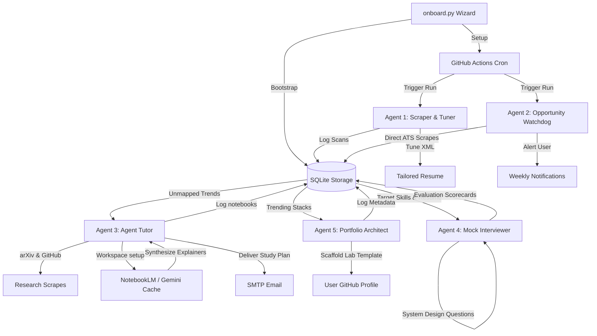

# Career Intelligence Engine

A serverless multi-agent ecosystem that automatically monitors job markets, scrapes stealth opportunities, tunes professional resumes, conducts interactive upskilling and mock interview loops, and scaffolds proof-of-work project repositories.

## Original Requirements

> On a weekly basis scan through all the job postings with location Pune and title ai product manager agentic ai product manager director / senior director of product management and vp of product manager and create me a database of the common themes across these postings, the idea is to use these common themes to write my resume, a base resume will be provided, please create an updated resume based on the scan results for that week and save it in a dropbox location using naming convention to clearly indicate the date of creation, once that is done send me an email with the Subject Update resume for week of <<date placeholder>> with the newly created resume attached.

## What it does (Unified Multi-Agent System)

1. **Job Scraper & Resume Tuner**: Scans regional job boards for AI PM / Director / VP of Product roles, extracts frequency-weighted technical themes, and edits experience bullets *in-place* to target high-probability keywords without corrupting document layouts.
2. **Agent Opportunity Watchdog**: Directly queries the Greenhouse and Lever ATS endpoints of top-tier AI organizations, identifying and alerts stealth job postings immediately upon publication.
3. **Agent Tutor**: Queries research repositories (arXiv API) and code libraries (GitHub APIs), programmatically deploys factual NotebookLM upskilling workspaces, generates voice-synthesis explainer podcasts, and emails a structured Weekly Study Plan.
4. **Agent Mock Interviewer**: Generates highly custom, difficulty-graded technical architecture and behavioral interview questions based on SQLite's weekly scanned themes and candidate resume bullets, evaluates performance, and logs evaluation scorecards.
5. **Agent Portfolio Architect**: Automatically translates trending technical stacks into fully structural open-source lab templates (source files, tests, requirements, and GitHub Actions CI pipelines) published directly to the user's GitHub account to display visible proof-of-expertise.

## End-to-End System Workflow

To visualize the interactions between the 5 specialized agents, relational database triggers, and deployment targets, refer to our comprehensive workflow diagram:



For a comprehensive, high-fidelity mapping of all 8 core career preparation use cases, data models, and system pathways, check out the dedicated **[System Workflow Specification](docs/SYSTEM_WORKFLOW.md)**.

## Documentation

### System Design & Workflows
* **[System Workflow Specification](docs/SYSTEM_WORKFLOW.md)** — Detailed Mermaid.js diagram and documentation of the 8 production career preparation use cases.
* **[Product & Technical Pitch](PITCH.md)** — Establishes the vision, system engineering trade-offs, and product decisions (e.g., Build vs. Buy, Defensive UX, and State persistence) directly aligning with **Agentic AI Product Manager** competencies, alongside the future NotebookLM upskilling roadmap.

### Anthropic SDK Implementation
- [System Design](DESIGN.md) — architecture, components, tech stack, agent flow
- [Visual Architecture](ARCHITECTURE.md) — Mermaid diagrams: system flow, scraper, theme pipeline, resume generation, sequence diagram, data model

### OpenClaw Implementation (Alternate)
- [OpenClaw Design](DESIGN_OPENCLAW.md) — Lobster YAML workflow, MCPorter integrations, memory architecture, SDK vs OpenClaw comparison
- [OpenClaw Architecture](ARCHITECTURE_OPENCLAW.md) — Mermaid diagrams: Gateway/TaskFlow, Lobster steps, MCP map, memory layout, sequence diagram

### Hybrid GHA + Python Implementation (Option 3 — Recommended)
- [Hybrid Design](DESIGN_HYBRID.md) — GHA runtime, python-docx XML manipulation, Apify integration, secret auto-refresh
- [Hybrid Architecture](ARCHITECTURE_HYBRID.md) — Mermaid diagrams: cloud system flow, ingestion pipeline, docx in-place edits, sequence flow
- [Agent Tutor Upskilling Design](DESIGN_AGENT_TUTOR.md) — Relational SQLite schemas, Google NotebookLM Client & universal Gemini fallbacks, deduplication checks, arXiv/GitHub crawl pipelines

## Status

> **Fully Operational** — The multi-agent engine is production-ready, running serverless weekly cron cycles via GitHub Actions, persisted via SQLite, and integrated with live learning and evaluation loops. See [PITCH.md](PITCH.md) for the product vision and [DESIGN_HYBRID.md](DESIGN_HYBRID.md) for the architectural blueprint.

---

## Deployment & Usage Guide

Follow these steps to deploy and run the **Career Intelligence Engine** locally or in a serverless GitHub Actions environment:

### 1. Prerequisite Setup
Ensure Python 3.8+ is installed. Clone the repository and install all required modules:
```bash
git clone https://github.com/mayukhg/mg-ai-job-scanner.git
cd mg-ai-job-scanner
pip install -r requirements.txt
```

### 2. Run the Interactive Onboarding Flow
Configure your profile, set scan frequencies, select job boards, specify notification targets, and safely hook up credentials without leaking them:
```bash
python onboard.py
```
> [!IMPORTANT]
> **Defensive UX Security**: Sensitive access keys (e.g. Gemini API Key, GitHub PAT, Dropbox Token) are written directly to a secure, git-ignored local `.env` file at your project root, preventing accidental commits while maintaining seamless developer access.

### 3. Execute the Ecosystem Main Loop
To trigger a manual scan, resume updates, mock interviewer questions, upskilling packs, and programmatic GitHub scaffolding, run:
```bash
python src/main.py
```

### 4. Serverless Cloud Setup (GitHub Actions)
To run this multi-agent loop 100% serverless on a weekly or daily schedule:
1. Ensure your settings (`config/settings.yaml`) are committed and pushed to your remote repository.
2. In your GitHub repository homepage, navigate to **Settings > Secrets and variables > Actions**.
3. Define the following Actions Repository Secrets matching your local `.env`:
   * `GEMINI_API_KEY`: Your Gemini/Google AI Studio key for upskilling caching and mock coaching.
   * `GITHUB_PAT`: GitHub personal access token with `repo` scopes to permit Agent Portfolio Architect to push scaffolds to your account.
   * `DROPBOX_ACCESS_TOKEN`: API token to sync relaid resumes and sqlite persistence vaults.
4. Navigate to the **Actions** tab in your repository and enable the pre-configured workflow scheduler.


