# Career Intelligence Engine — End-to-End System Workflow

This document provides a highly detailed, technical blueprint of the **Career Intelligence Engine (CIE)**, highlighting the relationships, data loops, and triggers between all five specialized AI agents, the central SQLite database state layer, the stateless Git-as-a-Database memory sync, and the outer deployment endpoints.

---

## 1. End-to-End System Workflow Diagram

The following Mermaid.js diagram illustrates the complete execution pipeline, from interactive setup to automated code publishing:

```mermaid
graph TB
    %% Styling Classes
    classDef frontend fill:#4a148c,stroke:#333,stroke-width:2px,color:#fff;
    classDef agent fill:#6a1b9a,stroke:#333,stroke-width:2px,color:#fff;
    classDef database fill:#1565c0,stroke:#333,stroke-width:2px,color:#fff;
    classDef api fill:#2e7d32,stroke:#333,stroke-width:1px,color:#fff;
    classDef deliverable fill:#e65100,stroke:#333,stroke-width:2px,color:#fff;
    classDef eventbus fill:#d32f2f,stroke:#333,stroke-width:2px,color:#fff;

    %% Configuration & Input
    subgraph Input_Layer ["1. Configuration & Security Gateway"]
        UI["Onboarding Webpage / CLI Portal<br/>(onboard.py)"]:::frontend
        YAML["System Preferences<br/>(config/settings.yaml)"]:::frontend
        ENV["Secure Credentials Vault<br/>(.env / Repo Secrets)"]:::frontend
        ResumeBase["Master Candidate Resume<br/>(Resume_Base.docx)"]:::frontend
    end

    %% Event Bus Broker
    subgraph Event_Broker ["2. In-Memory Communication Broker"]
        EventBus["🎛️ AgentEventBus<br/>(a2a_messaging.py)"]:::eventbus
    end

    %% Relational State Controller
    subgraph Database_State ["3. Relational Store & Memory (SQLite: themes.db)"]
        SQLiteDB[("🗄 SQLite DB<br/>(trends, scorecards, portfolios)")]:::database
        GitDB[("state_history.json<br/>(state-store branch)")]:::database
    end

    %% The 5 A2A Reactive Agents
    subgraph A2A_Agents ["4. Reactive Agentic Ecosystem"]
        Agent1["🤖 Tuner Agent<br/>(agent_resume_tuner)"]:::agent
        Agent2["🤖 Watchdog Agent<br/>(agent_opportunity_watchdog)"]:::agent
        Agent3["🤖 Tutor Agent<br/>(agent_tutor)"]:::agent
        Agent4["🤖 Mock Interviewer Agent<br/>(agent_mock_interviewer)"]:::agent
        Agent5["🤖 Portfolio Architect Agent<br/>(agent_portfolio_architect)"]:::agent
    end

    %% Deliverables
    subgraph Deliverables ["5. Dynamic CIE Deliverables"]
        ResumeOutput["Tailored Resume<br/>(Resume_WeekOf_*.docx)"]:::deliverable
        DropboxSync["Dropbox Cloud Sync<br/>(/Resumes/Weekly/)"]:::deliverable
        StealthAlert["Alert Notifications<br/>(Stealth Openings)"]:::deliverable
        StudyEmail["Weekly Study Plan Email<br/>(Briefs, Podcasts, Mindmaps)"]:::deliverable
        ScorecardMD["Markdown Scorecard Log<br/>(Interview Performance)"]:::deliverable
        GitRepo["TDD Pytest Workspace<br/>(Failing tests in src/tests/)"]:::deliverable
        StepSummary["GHA Step Summary<br/>(gha_run_summary.md)"]:::deliverable
    end

    %% Connections
    UI --> YAML & ENV
    YAML --> Agent1 & Agent2 & Agent3 & Agent4 & Agent5

    %% State Synchronization
    GitDB <-->|Load / Save state at startup/exit| SQLiteDB
    Agent1 & Agent2 & Agent3 & Agent4 & Agent5 <--> SQLiteDB

    %% Event Registrations
    Agent1 & Agent2 & Agent3 & Agent4 & Agent5 -->|1. Register to Bus| EventBus

    %% Dynamic Messaging Cascade
    Agent1 -->|2. send_message / RESUME_TUNED_FOR_TARGET| EventBus
    EventBus -->|3. Route event| Agent4
    
    Agent4 -->|4. send_message / UPSKILLING_REQUIRED| EventBus
    EventBus -->|5. Route event| Agent3

    Agent3 -->|6. send_message / UPSKILLING_BRIEF_COMPILED| EventBus
    EventBus -->|7. Route event| Agent5

    %% External Scrapers & Tasks
    Agent1 -->|Trigger Crawls| Apify["Apify Scraper Crawler"]:::api
    Agent2 -->|Check ATS Pipelines| ATS["ATS Greenhouse & Lever"]:::api

    %% Deliverable Outputs
    Agent1 --> ResumeOutput --> DropboxSync
    Agent2 --> StealthAlert
    Agent3 --> StudyEmail
    Agent4 --> ScorecardMD
    Agent5 --> GitRepo
    SQLiteDB -->|observability.py| StepSummary
```

---

## 2. Deep-Dive: The 8 Core Production-Grade Use Cases

The Career Intelligence Engine operates across **eight core career optimization use cases** represented in the diagram:

### Use Case 1: Interactive Onboarding & Bootstrapping
* **Actors**: User, `onboard.py` Onboarding Wizard.
* **Flow**: The user runs the wizard to set scan frequency, toggle scraper backends, input the notification email, choose learning modes, and hook up target stealth companies.
* **Value**: Separates general preferences (saved in `settings.yaml`) from secure API keys (written to a local, git-ignored `.env` file), ensuring zero-leak security.

### Use Case 2: In-Place Resume Tuning & GitHub Reverse Loop
* **Actors**: Agent 1 (Resume Tuner), SQLite Database, User GitHub Profile.
* **Flow**: Agent 1 extracts frequency-weighted keywords from Pune job openings and scrapes the user's public GitHub repositories for hidden projects/languages. It modifies XML text runs *in-place* to target high-probability keywords while maintaining the baseline layout. Once successfully updated, it dispatches the `RESUME_TUNED_FOR_TARGET` point-to-point message to the Event Bus to alert the Mock Interviewer.
* **Value**: Optimizes the resume to bypass ATS filters by extracting concrete, unstated candidate strengths from their active coding portfolio.

### Use Case 3: Stealth Opportunity Alerts
* **Actors**: Agent 2 (Opportunity Watchdog), Greenhouse/Lever ATS APIs, SQLite Database.
* **Flow**: Agent 2 directly scrapes target AI companies' public ATS pipelines. It runs unique-key database checks to deduplicate listings.
* **Value**: Discovers stealth opportunities immediately upon publication, bypassing aggregator platforms and giving you an application headstart.

### Use Case 4: Scholarly & Developer Ingestion
* **Actors**: Agent 3 (Agent Tutor), arXiv Search API, GitHub API.
* **Flow**: Reacting to `UPSKILLING_REQUIRED` events routed by the Event Bus, Agent 3 takes the target skill gap topic and executes academic searches (arXiv papers) and code searches (popular GitHub templates).
* **Value**: Ground-truths the upskilling payload on academic whitepapers and real developer patterns instead of generic web content.

### Use Case 5: Workspace Brief Compilation
* **Actors**: Agent 3 (Agent Tutor).
* **Flow**: Agent 3 compiles target blogs, architecture documentation, and arXiv findings into a single `notebook_ingest_source.md` (or topic-specific briefs) structured with pre-formatted anchors (`[EXECUTIVE SUMMARY]`, `[CORE TECH STACK ANALYSIS]`).
* **Value**: Generates a hyper-dense learning source document optimized for NotebookLM context ingestion and maximum recall fidelity.

### Use Case 6: Continuous Upskilling & Study Plan Delivery
* **Actors**: Agent 3 (Agent Tutor), SMTP Email Server.
* **Flow**: Agent Tutor triggers generative models to synthesize study materials (multimodal audio WAV podcast, Mermaid.js mindmap diagram, and video storyboard script outline) and emails the package with the ingestion brief paths to the candidate. Once finished, it publishes `UPSKILLING_BRIEF_COMPILED` on the Event Bus to trigger the Portfolio Scaffolder.
* **Value**: Delivers an automated, highly personalized weekly study plan directly to your inbox.

### Use Case 7: Adaptive Behavioral & Technical Interview Coaching
* **Actors**: Agent 4 (Agent Mock Interviewer), Candidate, SQLite Database.
* **Flow**: Triggered by `RESUME_TUNED_FOR_TARGET` events, Agent 4 retrieves target skills and the candidate's resume. It generates technical architecture and behavioral questionnaires calibrated to selected difficulties (`easy`/`medium`/`hard`/`executive`). It simulates responses and writes a rating scorecard (`scorecard_*.md`). If the candidate's readiness rating falls below a target threshold, it sends a point-to-point `UPSKILLING_REQUIRED` event to Agent Tutor.
* **Value**: Conducts rigorous, tailored technical system-design interview sessions and registers historical readiness ratings in the database.

### Use Case 8: Pytest Test-Driven Development (TDD) Scaffolding
* **Actors**: Agent 5 (Agent Portfolio Architect), GitHub Remote Repository.
* **Flow**: Reacting to `UPSKILLING_BRIEF_COMPILED` messages, Agent 5 identifies trending stack combinations and scaffolds a complete, functioning TDD workspace (README, pytest.ini, requirements.txt, and stubs in `src/main.py`). Crucially, it populates `tests/test_core.py` with failing pytest specifications checking system behaviors, state initialization, and security audits.
* **Value**: Challenges the candidate to write implementation code to make all tests pass, producing a credible, active GitHub repository demonstrating hands-on expertise.
